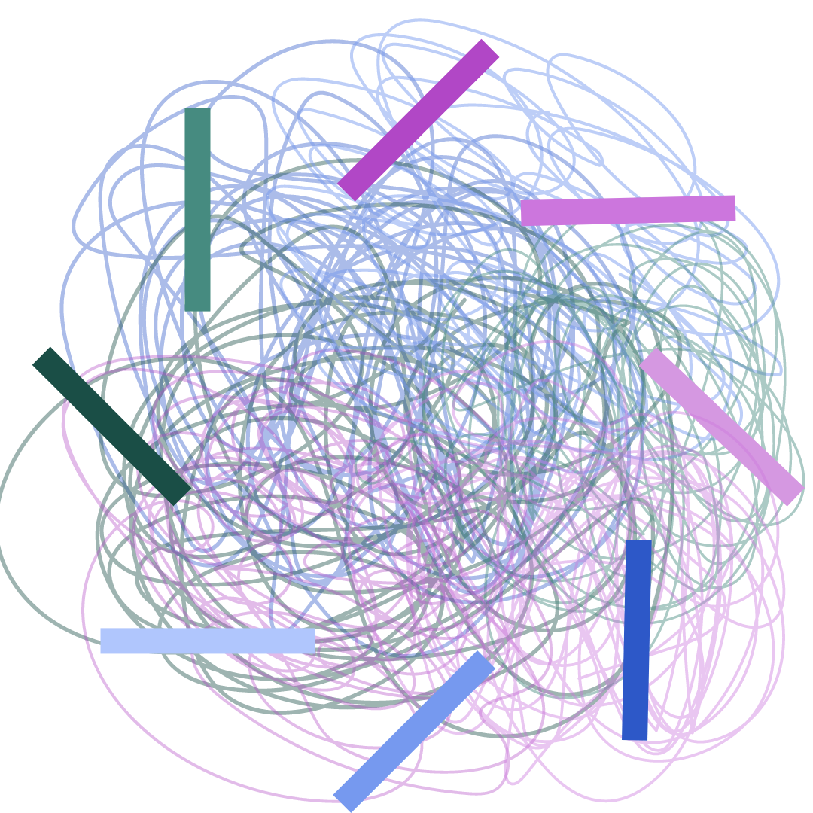

# Minimally Informed CMB MAp Constructor: MICMAC



_MICMAC Logo, credits: Ema Tsang King Sang_

Pixel implementation of the non-parametric component separation of [Leloup et al. (2023)](https://journals.aps.org/prd/abstract/10.1103/PhysRevD.108.123547), as described in [Morshed et al. (2024)](https://arxiv.org/abs/2405.18365).


## Installation

The easiest way to install and use `micmac` is the following

- clone the repo
    ```
    git clone https://github.com/CMBSciPol/MICMAC && cd MICMAC
    ```
<!--
- create a virtual environment with the required dependencies, with `conda`,
    ```bash
    conda create micmac_env
    conda activate micmac_env
    ```
    or, with `virtualenv`,
    ```bash
    virtualenv micmac_env
    source micmac_env/bin/activate
    ```
-->
- install `micmac`
    ```bash
    python -m pip install .
    ```
    or, for development,
    ```bash
    python -m pip install -e .
    ```

The tutorials and tests make use of additional Python libraries not installed by default, to install the full version of micmac with those libraries use:
```bash
python -m pip install .[full]
```
    
**Note:** this package uses the [JAX library](https://jax.readthedocs.io), hence can be run on GPUs. If you run on GPUs or TPUs install JAX by following the official [installation guide](https://jax.readthedocs.io/en/latest/installation.html).


## How to use `micmac`
You will find in the `tutorials` directory notebooks showcasing how to use `micmac`.

Note: 
* The package performs highly expensive computations, we advice to allow for a sufficiently large number of cores.
* If you fork the repository and want to commit some changes, you may want to use pre-commit:
    ```bash
    pip install pre-commit
    pre-commit install
    ```
    When committing with pre-commit, your changes will probably be reformatted, you must then re-add them and re-commit.


## License
This code is released under the GPLv3 license, which can be found in the [LICENSE](./LICENSE) file.


## Contact
For any solicitation, please contact `morshed at apc.in2p3.fr` or `rizzieri at apc.in2p3.fr`.


## Citation
If you use `micmac`, please consider citing:
```
@misc{morshed2024pixel,
      title={Pixel domain implementation of the Minimally Informed CMB MAp foreground Cleaning (MICMAC) method},
      author={Magdy Morshed and Arianna Rizzieri and Cl\'ement Leloup and Josquin Errard and Radek Stompor},
      year={2024},
      eprint={2405.18365},
      archivePrefix={arXiv},
      primaryClass={astro-ph.CO}
}
@article{Leloup:2023vkb,
    author = "Leloup, Cl\'ement and Errard, Josquin and Stompor, Radek",
    title = "{Nonparametric maximum likelihood component separation for CMB polarization data}",
    eprint = "2308.03412",
    archivePrefix = "arXiv",
    primaryClass = "astro-ph.CO",
    doi = "10.1103/PhysRevD.108.123547",
    journal = "Phys. Rev. D",
    volume = "108",
    number = "12",
    pages = "123547",
    year = "2023"
}
```
